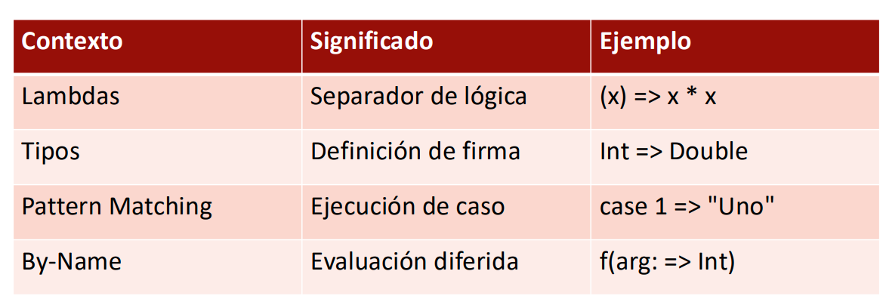
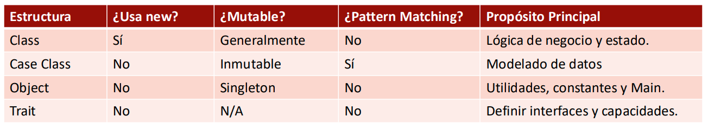
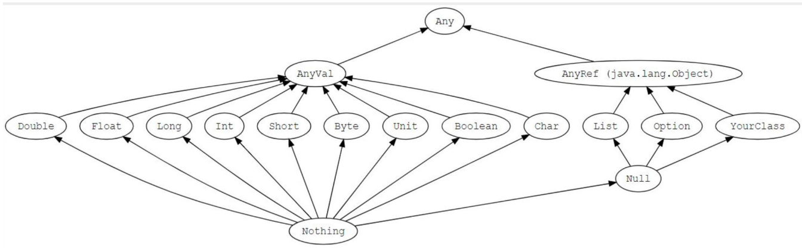
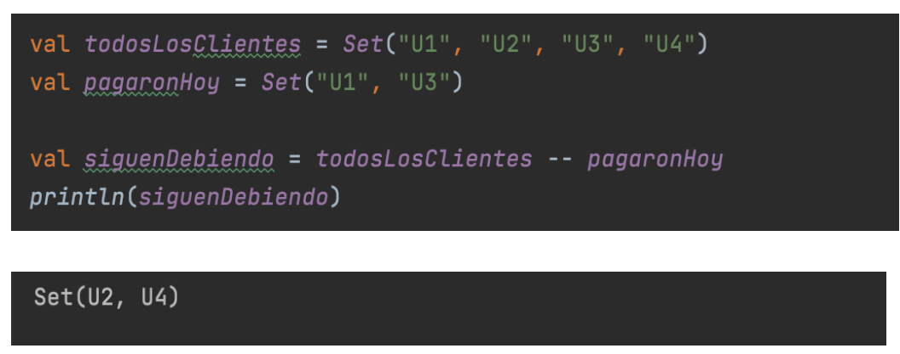
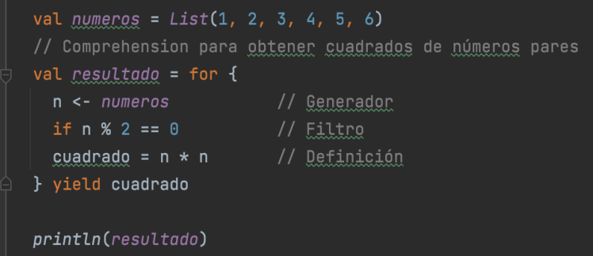
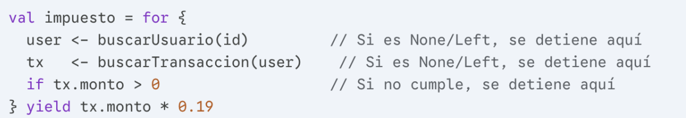

# PFSD-SCALA-CHEATSHEET

This is a cheatsheet for the PFSD course in Scala. It contains the most important concepts and syntax that you need to know for the course.

## Inmunatavity vs Mutability
- Inmunatavity: Once a value is assigned to a variable, it cannot be changed. This is the default in Scala.
    - **val:** Make reference to a value that cannot be changed.
    - It is a constant
    - The type is inferred by the compiler, but it can also be explicitly declared.

```scala
val x = 5
val lastName: String = "Henao"
```

- Mutability: A variable can be reassigned to a new value. This is achieved using
    - **var:** Make reference to a value that can be changed.
    - It is a variable
    - The type is inferred by the compiler, but it can also be explicitly declared.

```scala
var age = 21
var name: String = "David"
```
- Thanks to the **Structural Sharing** and the **Garbage Collector** in Scala, we can have both inmunatavity and mutability in our programs without worrying about memory management. 

## Structural Sharing
- Scala uses **Persistent Data Structures** which are immutable data structures that share their structure with previous versions of themselves. 

```scala
val listA = List(1, 2, 3)
val listB = 0 :: listA // listB is a new list
println(listA) // List(1, 2, 3)
println(listB) // List(0, 1, 2, 3)
```
- listB is a new node that has a pointer to listA
- Both share the same the same nodes
- Inmutabily ensures that we can safely share data without worrying changes to the data structure.

## Garbage Collector
- Scala with the JVM uses a **Garbage Collector** to automatically manage memory.

## Operator Right Arrow(=>)



### Lamba functions definition
- The right arrow (=>) is used to define lambda functions in Scala. It separates the parameters from the body of the function.

```scala
//(parameters) => { body }
val duplicar = (x: Int) => x * 2
println(duplicar(5)) // 10

val list = List(1, 2, 3, 4, 5)
list.map(x => x * 2) // List(2, 4, 6, 8, 10)
```
### Function types (Signatures)
- The right arrow (=>) is also used to define function types in Scala. It separates the parameter types from the return type of the function.

- Is usefull of HOF (Higher Order Functions) and for defining function types in general.

```scala
val transform: 
Int => String = (x: Int) => s"Number: $x"
```
- In this example, `transform` is a function that takes an `Int` as a parameter and returns a `String`. The type signature `Int => String` indicates that the function takes an `Int` and returns a `String`.

### Patern Matching
- The right arrow (=>) is also used in pattern matching to separate the pattern from the expression that should be evaluated if the pattern matches.

- In a match expression, it separates the case pattern from the result expression.

```scala
val operation = "-"

operation match {
  case "+" => println("Addition")
  case "-" => println("Subtraction")
  case _   => println("Unknown operation")
}
println(operation) // Subtraction
```

### Parameters by name (Lazy evaluation)
- This means that the parameter is not evaluated until it is used in the function body.

```scala
def expensiveComputation(): Int = {
  println("Computing...")
  Thread.sleep(1000)
  42
}

// By Value: Always executes the computation
def ifByValue(condition: Boolean, value: Int): Int = {
  if (condition) value else 0
}

// By Name: Only executes if needed
def ifByName(condition: Boolean, value: => Int): Int = {
  if (condition) value else 0
}

ifByValue(false, expensiveComputation())  
// Prints "Computing..." even though we don't use the result

ifByName(false, expensiveComputation())   
// Doesn't print anything! The function is never called
```

## Methods
- Methods are defined using the `def` keyword and can have parameters and a return type. They can also be recursive.

```scala
// Recursive method to calculate factorial
def factorial(n: Int): Int = {
  if (n == 0) 1
  else n * factorial(n - 1)
}

// Method to apply a function to an integer
def applyFunc(x: Int, f: Int => Int): Int = f(x)

// Method to return a function based on an operation
def mathOperation(operation: String): (Int, Int) => Int = operation match {
  case "+" => (a: Int, b: Int) => a + b
  case "-" => (a: Int, b: Int) => a - b
  case "*" => (a: Int, b: Int) => a * b
  case "/" => (a: Int, b: Int) => a / b
  case _  => (a: Int, b: Int) => 0 
}
```

## Pattern Matching
- Similar to switch in java, this one evaluates a pattern and executes the corresponding code block.

- Compare values

```scala
val state = "Error"

state match {
  case "Error" => println("An error occurred")
  case "Success" => println("Operation successful")
  case _ => println("Unknown state")
}
```
- Check types

```scala
def describe(x: Any): String = x match {
  case i: Int => s"An integer: $i"
  case s: String => s"A string: $s"
  case d: Double => s"A double: $d"
  case b: Boolean => s"A boolean: $b"
  case l: List[_] => s"A list: $l"
  case _ => "Unknown type"
}

println(describe(42)) // An integer: 42
println(describe("Hello")) // A string: Hello
```

- Deconstructing structures

```scala
case class Transaccion(value: Double, currency: String)

val t = Transaccion(100.0, "USD")

t match {
    case Transaccion(m, "USD") if m > 50 => println(s"High value transaction: $m USD")
    case Transaccion(m, "EUR") => println(s"Low value transaction): $m EUR")
    case Transaccion(m, c) => println(s"Transaction of $m in $c")
    case  _ => println("Unknown transaction")
}
println(t) // High value transaction: 100.0 USD
```
- Apply guards
```scala
case class Cliente(name: String, age: Int)

val c = Cliente("Alice", 30)

c match {
    case Cliente(name, age) if age < 18 => println(s"$name is a minor")
    case Cliente(name, age) if age >= 18 => println(s"$name is an adult")
    case _ => println("Unknown client")
}
println(c) // Alice is an adult
```

### Class
- Same as POO, when you need encapsulation, inheritance, polymorphism, mutiple instances and mutable state.
- Instantance with **new**.
- The constructor is defined in the class parameters.
- **var** applies to mutable fields, while **val** applies to immutable fields.

```scala
class BankAccount(val name: String, var balance: Double) {
  def deposit(amount: Double): Unit = {
    balance += amount
  }

  def withdraw(amount: Double): Unit = {
    if (amount <= balance) balance -= amount
    else println("Insufficient funds")
  }
}

val account = new BankAccount("Alice", 1000.0)
account.deposit(500.0)
account.withdraw(200.0)
println(account.balance) // 1300.0
```
### Case Class
- Opmitimized for immutability and pattern matching.
- Automatically generates methods like `toString`, `equals`, `hashCode` and `copy`.
- No need to use **new** to create an instance.
- Depend only on their parameters given at the constructor, so they are ideal for modeling data.
- When comparing two case class instances, they are considered equal if their parameters are equal not by memory reference.

```scala
case class Point(x: Int, y: Int)
val p1 = Point(1, 2)
val p2 = Point(1, 2)
println(p1 == p2) // true
println(p1) // Point(1, 2)
val p3 = p1.copy(y = 3)
println(p3) // Point(1, 3)
```
### Object

- Singleton, only one instance exists.
- Created using the `object` keyword.
- Used for utility methods, constants, or to hold the main method of an application.
- Dont need to be instantiated, you can access its members directly through the object name.

```scala
object CalcTaxes{
    val IVA = 0.19
    def calculateTax(amount: Double): Double = amount * IVA 
}

val total = calcTaxes.calculateTax(100.0)
println(total) // 19.0
```
### Companion Object
- An object that shares the same name as a case class and is defined in the same file.
    - Class: Contains the data of the instances.
    - Companion Object: Contains methods and values related to the class, like static in Java.

### Traits
- Similar to interfaces in Java, but can also contain concrete methods and fields.
- Used to define common behavior that can be mixed into classes.
- a class can extend multiple traits, allowing for a form of multiple inheritance.

```scala
trait Autenticable {
  def login(user: String, password: String): Boolean = {
    println(s"Logging in user: $user")
    true
  }
}
trait Notificable {
  def sendNotification(message: String): Unit = {
    println(s"Sending notification: $message")
  }
}
```
> [Note] Unit is similar to void in Java, it indicates that the method does not return a value.

## Summary


## Filter
- The `filter` method is used to create a new collection that contains only the elements that satisfy a given predicate (a function that returns a Boolean). 
- It is affectuated on collections like List, Set, Map, etc.

```scala
val numbers = List(1, 2, 3, 4, 5)

// Explicit option
val evenNumbers = numbers.filter(n => n % 2 == 0)
println(evenNumbers) // List(2, 4)

// Using underscore as a placeholder 
val mayorThanThree = numbers.filter(_ > 3)
println(mayorThanThree) // List(4, 5)

val withoutTwo = numbers.filterNot(_ == 2)
println(withoutTwo) // List(1, 3, 4, 5)
```

## Map
- The `map` method is used to create a new collection by applying a given function to each element of the original collection.

```scala
val numbers = List(1, 2, 3, 4, 5)

val squaredNumbers = numbers.map(n => n * n)
println(squaredNumbers) // List(1, 4, 9, 16, 25)

val stringNumbers = numbers.map(_.toString)
println(stringNumbers) // List("1", "2", "3", "4", "5")


case class Employee(name: String, salary: Double)

val nomina = List(
    Employee("Alice", 3000), 
    Employee("Bob", 2500), 
    Employee("Charlie", 4000))
val names = nomina.map(_.name)
println(names) // List("Alice", "Bob", "Charlie")
val salaries = nomina.map(_.salary*1.1) // Increase salary by 10%
println(salaries) // List(3300.0, 2750.0, 4400.0)
```

## Option
- The `Option` type is used to represent a value that can be present (Some) or absent (None). It is a more elegant alternative to using null values.

```scala
val someValue: Option[Int] = Some(42)
val noValue: Option[Int] = None

println(someValue) // Some(42)
println(noValue) // None

case class User(name: String, age: Option[Int])
val user1 = User("Alice", Some(30))
val user2 = User("Bob", None)
println(user1) // User(Alice,Some(30))
println(user2) // User(Bob,None)
```

## Flatten
- The `flatten` method is used to convert a collection of collections into a single collection by concatenating the inner collections.

```scala
val nestedList = List(List(1, 2), List(3, 4), List(5))
val flatList = nestedList.flatten
println(flatList) // List(1, 2, 3, 4, 5)

//String are also collections of characters
val nestedString = List("Hello", "World")
val flatString = nestedString.flatten
println(flatString) // List(H, e, l, l, o, W, o, r, l, d)

//Cleaning null values with flatten
val listWithNulls = List(List(1, 2), null, List(3, 4), null, List(5))
val cleanedList = listWithNulls.flatten
println(cleanedList) // List(1, 2, 3, 4, 5)

//Cleaining Option values with flatten
val listWithOptions = List(Some(1), None, Some(2), None, Some(3))
val cleanedOptions = listWithOptions.flatten
println(cleanedOptions) // List(1, 2, 3)
```

## FlatMap
- The `flatMap` method is a combination of `map` and `flatten`. 

```scala

val nestedList = List(List(1, 2), None, List(3, 4), None,List(5))
val flatMappedList = nestedList.flatMap(n => n.map(_ * 2))
println(flatMappedList) // List(2, 4, 6, 8, 10)

## head, last, tail, init
- These methods are used to access specific parts of a collection.

```scala
val numbers = List(1, 2, 3, 4, 5)
println(numbers.head) // 1
println(numbers.last) // 5
println(numbers.tail) // List(2, 3, 4, 5)
println(numbers.init) // List(1, 2, 3, 4)
```
- What happens if we call these methods on an empty list?

```scala
val emptyList = List()
println(emptyList.head) // Throws NoSuchElementException
println(emptyList.headOption) // None
```


## Distinct
- The `distinct` method is used to remove duplicate elements from a collection.

```scala
val numbers = List(1, 2, 2, 3, 4, 4, 5)
val distinctNumbers = numbers.distinct
println(distinctNumbers) // List(1, 2, 3, 4, 5)
```

## Fold Operations
- Folding is a supeior order function that allows to merge all elements of a collection in a single one value, usign a binary funtion and an initial value. Similiar to a for operation

### Params:
- `Seed` with a initial value
- `Funtion` aplied for the seed and every element of the colection

### Types:
- `foldLeft`: Process every elemento from left to right
- `foldRight`: Process from right to left
- `fold`: No order, can process from any part.

```scala
val mov = List(100.0, -50.0, 200.0, -20.0)

//Initial value: 0.0
val finalLeft = mov.foldLeft(0.0)((b,a) => b + a)
// (((0.0+100) - 50) + 200) - 20) = 230

val finalRight = mov.foldRight(0)(_ - _)
// 100 - (-50 - (200 - (-20 - 0))) = -270
```

### Jerarquia de Tipos en Scala  


- `Any` es el super tipo de Scala. Todas las clases heradan de Any, es la raiz de toda la jerarquia. Every varibale is a instance of Any

- `AnyVal` and `AnyRef` are direct subclasses

-`AnyVal` make a reference to the primitive values: Double, Int, Char, etc...

- `AnyRef` are user defined objects and java clases

- `Nothing` is a subtype of all, there are no instances of nothing and it is used for funtions that never return nothing

-  `Unit` is a object used in functions that do not return, similar to `java` void
```scala
def registrarLog(mensaje: String): Unit = {
  println("hallo") //Return Unit
}
```
- Due to `Any` scala allow list of multiple data types
```scala
val list: List[Any] = {
  "Transferencia",
  150.0,
  true
}
```

### Tuples:
- A `Tuple` groups a fixed number of elements where each one can have its own type
- Are inmutables
- Usefull to retunr more than a single value
```scala
val saldoCliente = ("U001", 1500.80)
//Access
println(saldoCliente._1) //U001
println(saldoCliente._2) //1500.80
```
```scala
def validarTransaccion(monto: Double): (Boolean, String) = {
  if (monto > 0) (true, "Monto valido")
  esle (false, "Monto invalido")
}
val (esValido,mensaje) = validarTransaccion(-50.0)
print(esValido) //False
print(mensaje) //Monto invalido
```

### Zip
- Takes two colecctions and merge them into a sigle tuple.
- If the colecttions have diferent lengt, the result trucante to the smallest
```scala
val clientes = List("Ana", "Pedro", "Luis")
val deudas = List(150.0, 300.0, 50.0)

val reportes = clientes.zip(deudas) // List((Ana,150.0), (Pedro,300.0), (Luis,50.0))
```
### ZipWithIdex
- Pairs each element with its position
```scala
val transacciones = List("A", "B", "C")
val conindice = transacciones.zipWithIndex // List((A,0), (B,1), (C,2)
```
### ZipAll
```scala
val cuentas = List("C1", "C2", "C3")
val saldos = List(1000, 2000)

val result = cuentas.zipAll(saldos, "Desconocido", 0)
println(result)// List((C1,1000), (C2,2000), (C3,0))
```
## Unzip
- Take a tuples colection and divides it in diferent colecctions
```scala
val datos = List((C1,1000), (C2,2000))
val (ids, montos) = datos.unzip
println(ids) //List(C1, C2)
println(montos)//List(100, 200)
```
## Sliding
- Divides a colecction in small groups of an especified (`size`), and moves a determined numbers of elements(`step`) en eacgh iteration.
- Returns not a list but a `Iterator`
- `Size`: How many elements are in every window
- `Step`: How many elements jump for the next window 
```scala
val montos = List(10,20,30,40,50)

val windows = montos.sliding(3,1)
println(windows) //<iterator>

val windows2 = montos.sliding(3,1).toList
println(windows2) // List(List(10,20,30), List(20,30,40), List(30,40,50))
```

## Slice
- slice(from, until) extrae una seccion de la coleccion desde un indice hasta otro
```scala
val transacciones = (1 to 100).toList
val paginar = transacciones.slice(10,29)
println(paginar) //List(11, 12, 13, 14, 15, 16, 17, 18, 19, 20)
```

## isEmpty:
Devuelve true si la coleccion no contiene elementos

## nonEmpty:
Es el opuesto, true si la coleccion tiene almenos un elemento

-Anmas son las eficientes y semanticas que usar size

## Operadores sobre colecciones:
  -`:+` agrega un elemento al final
  -`+:` agrega un elemento al inicio
  -`::` solo en las listas, agrega un elemento al inicio
  -`++` contantena dos colecciones
  -`-` elimina un elemento en especifico
  -`--` elimina todos los elementos de una coleccion presentes en otra
  -`contains/apply` verifica existencia
  -`%/|` interseccion y union



## Map:
Coleccion de pares formados por `(key)` y `(value)`
- Inmutables
- Las llaves son unicas
- Los valores se pueden repetir
```scala
val saldos = Map("U1" -> 100, "U2" -> 500)
val s1 = saldos("U1") //100
val s2 = saldos("U3") //Java Exception
val s1 = saldos.get("U3") //None 
val s1 = saldos.getOrElse("U3", 0) //0
```
## Monadas:
encapsula valores y permite encadenar operaciones de forma segura y composable.
```scala
val numeros = List(1, 2, 3)

// flatMap aplana los resultados
val resultado = numeros.flatMap(n => List(n, n * 10))
println(resultado)  // List(1, 10, 2, 20, 3, 30)

// Con for-comprehension
val combinaciones = for {
  x <- List(1, 2)
  y <- List(10, 20)
} yield x + y

println(combinaciones)  // List(11, 21, 12, 22)
```

### For Comprehension:
- Generadores (<-): Introducen nuevas variables y recorren
colecciones
- Filtros (if): Permiten añadir condiciones para incluir elementos (ej.
if x > 0).
- Definiciones (=): Asignan valores intermedios, útil para evitar
cálculos repetidos



## Either:
Representa un valor que puede ser de dos tipos diferentes. Es especialmente útil para manejar errores de forma explícita.

Either[A, B]
- Left[A]: Representa el error
- Right[B]: Representa el éxito

```Scala
def dividir(a: Int, b: Int): Either[String, Double] = {
  if (b == 0) 
    Left("Error: División por cero")
  else 
    Right(a.toDouble / b)
}

val resultado1 = dividir(10, 2)
println(resultado1)  // Right(5.0)

val resultado2 = dividir(10, 0)
println(resultado2)  // Left(Error: División por cero)
```
```Scala
val resultado = dividir(10, 0)

resultado match {
  case Left(error) => println(s"Falló: $error")
  case Right(value) => println(s"Resultado: $value")
}
// Output: Falló: Error: División por cero
```

## Nil:
- Nil representa una lista vacía de tipo List[Nothing].
- se puede aplicar las diferentes funciones que List provee.
- Es el "Caso Base": En la programación funcional y recursiva,
Nil es el punto donde todas las listas terminan.
- Tipo Seguro: A diferencia de null, Nil es una instancia
legítima de List. 
- Puedes llamar a métodos como .size, .map o
.filter sobre Nil sin que el programa explote.
